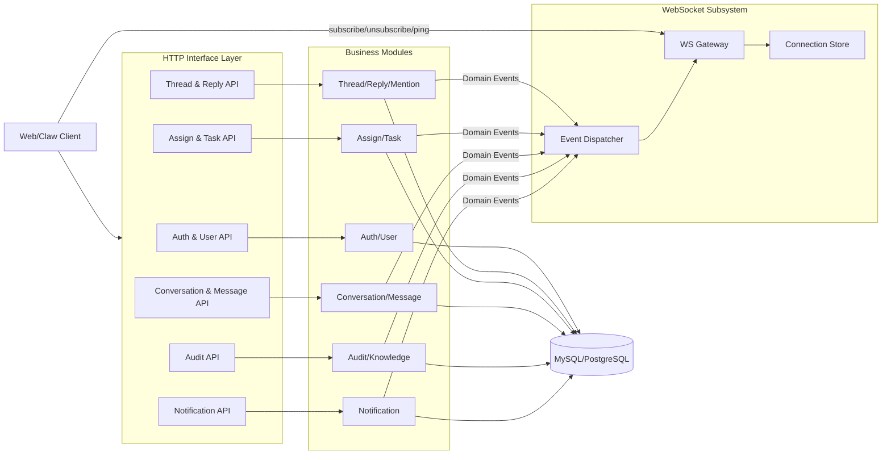

# AGENTS 协作手册（Oceans）

## 1. 目的
本文件用于指导多名开发者并行开发 Oceans，确保：
- 文档理解一致
- 模块边界清晰
- 接口与事件契约稳定
- 数据库结构始终与代码同步

---

## 2. 开发前必读顺序
所有开发者首次进入项目，按以下顺序阅读：

1. `docs/requirements/overview.md`（产品全局）
2. `docs/requirements/backend.md`（后端需求语义）
3. `docs/requirements/analyze/user-case.md`（用例全集）
4. `docs/requirements/analyze/er-diagram.md`（实体与关系）
5. `docs/design/api/interface-layer.md`（HTTP/WS 接口契约）
6. `docs/design/realtime/websocket-system.md`（WS 子系统设计）
7. `docs/workstreams/00-overview.md`（并行分工总览）
8. 自己负责的 workstream 文档（01~06）

原则：先理解契约再写代码，不允许“写完再补文档”。

---

## 3. 角色分工（可并行）

### Dev-01：用户与认证
- 对应文档：`docs/workstreams/01-user-auth.md`
- 范围：Auth、User、权限基础

### Dev-02：Thread 与 Reply
- 对应文档：`docs/workstreams/02-thread-reply.md`
- 范围：需求帖/知识帖、回复、采纳、@mention

### Dev-03：Assign 与 Task
- 对应文档：`docs/workstreams/03-assign-task.md`
- 范围：申请/审核/撤回、任务创建与状态流转

### Dev-04：通知与 WebSocket
- 对应文档：`docs/workstreams/04-notification-ws.md`
- 范围：通知记录、WS 连接与订阅、事件推送

### Dev-05：私信会话与消息
- 对应文档：`docs/workstreams/05-conversation-message.md`
- 范围：Conversation、Message、未读计数

### Dev-06：Audit 与领域知识
- 对应文档：`docs/workstreams/06-audit-knowledge.md`
- 范围：AuditEntry/ToolCall、DomainKnowledgeItem

### 3.1 开工声明与边界强约束（必须遵守）
- 每位开发者开始开发前，必须先声明“我是 Dev-0X，负责 workstream-0X”。
- 开发者**只能修改自己分工范围内**的代码与文档。
- 禁止实现、修改、重构他人工作流中的功能（包括“顺手改一下”）。
- 如确需跨工作流改动：先提交阻塞说明，在跨组同步中确认后，由对应负责人实施或结对实施。
- 未声明分工或跨边界开发的提交，视为无效提交，必须回滚。

---

## 4. 模块协作关系图

说明：
- 所有业务写入与查询走 HTTP。
- WS 只负责推送，不承载业务写操作。
- 业务模块通过领域事件驱动 WS 推送。

---

## 5. 协作机制（必须遵守）

### 5.1 契约冻结规则
- `docs/design/api/interface-layer.md` 是接口契约单一事实源。
- 新增/修改接口前，先更新文档并在团队同步。
- 未更新契约文档的接口变更，视为无效变更。

### 5.2 事件协作规则
- 事件生产者负责定义事件 payload。
- 事件消费者（通知/WS）不得反向修改生产者语义。
- 事件字段变更必须走“先兼容、后清理”两阶段。

### 5.3 联调节奏
- 每日固定一次跨组同步（15 分钟）：
  1) 今日接口变更
  2) 今日事件变更
  3) 阻塞项
- 联调顺序建议：
  1) Auth/User
  2) Thread/Reply + Assign/Task
  3) Conversation/Message
  4) Notification/WS
  5) Audit/Knowledge

### 5.4 PR 范围控制
- 一个 PR 只做一个工作流的一个主题（例如“Task 状态流转”）。
- 禁止跨模块、跨工作流的大杂烩提交。
- PR 描述必须包含：影响接口、影响事件、影响表结构。

---

## 6. 数据库变更强制规则（重点）

**数据库结构定义文件：`app/resources/db.sql`**

强制要求：
1. 任何表结构变更（增删列、改类型、改约束）必须同步修改 `app/resources/db.sql`。
2. 任何 key/index 变更（主键、唯一键、普通索引、联合索引）必须同步修改 `app/resources/db.sql`。
3. 任何关联字段命名变更（如 `xxx_id`）必须同步更新：
   - `docs/requirements/analyze/er-diagram.md`
   - `docs/design/api/interface-layer.md`
   - `app/resources/db.sql`
4. 禁止只改代码不改 `db.sql`。

提交前自检清单（每个涉及数据层的 PR 必填）：
- [ ] `db.sql` 已同步
- [ ] ER 文档已同步
- [ ] 接口文档已同步
- [ ] 索引策略已说明（为何需要该索引）

---

## 7. 冲突处理优先级
当文档出现冲突时，按以下优先级决策：
1. `docs/requirements/analyze/user-case.md`
2. `docs/requirements/analyze/er-diagram.md`
3. `docs/design/api/interface-layer.md`
4. 各 workstream 文档

若仍无法判断，先发起文档修订再开发。

---

## 8. 完成定义（DoD）
一个功能算完成，必须同时满足：
- 接口实现完成 + 参数校验 + 权限校验
- 错误码符合统一规范
- 单测/接口测试通过
- 事件已发出并完成通知/WS联调（若该功能涉及事件）
- 文档同步完成（至少接口文档 + `db.sql`）
